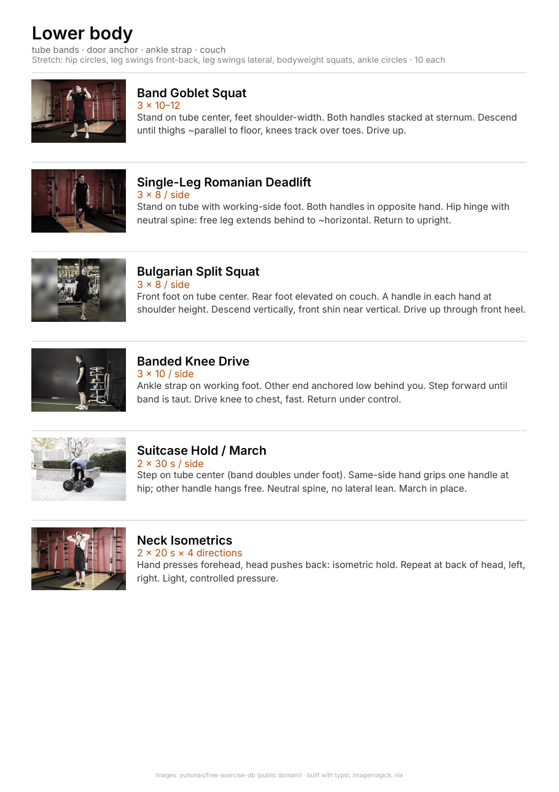

# workouts

One-page PDF workout sheets, vertical layout, optimised for reading on a phone or printing. Each workout is a Typst file; exercise images come from [yuhonas/free-exercise-db](https://github.com/yuhonas/free-exercise-db) (public domain) and are post-processed for a consistent look.



## build

Requires [Nix](https://nixos.org) with flakes.

```bash
nix develop          # dev shell: typst, curl, jq, imagemagick
scripts/fetch.sh     # download and process images listed in mappings.toml
scripts/build.sh     # compile workouts/*.typ to dist/*.pdf
```

## new workout

Copy a file under `workouts/`, edit it, then re-run `fetch.sh` and `build.sh`. New exercise names need a row in `mappings.toml`; use `scripts/search.sh <term>` to find the right id.

Cue style guide and conventions live in `CLAUDE.md`.
